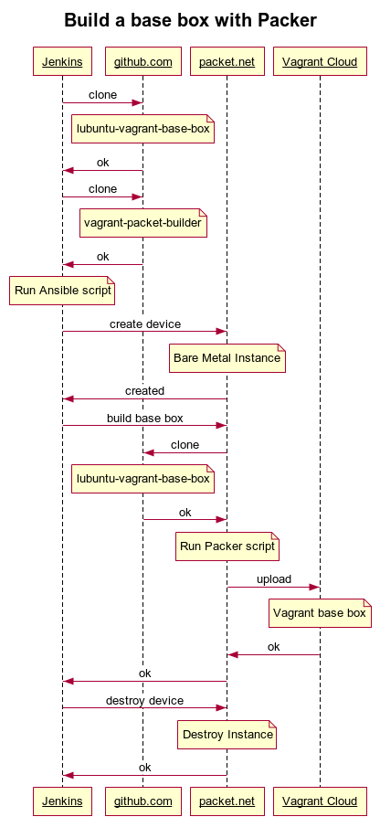

# Creating a Vagrant base box
This section describes how to create a base box for [Vagrant](https://www.vagrantup.com/). The base box will be built at [packet.net](https://www.packet.net/), a baremetal cloud provider. Finally the new base box is uploaded to [Vagrant Cloud](https://app.vagrantup.com/).

## Prerequisites
See [README.md](README.md) for general prerequisites.

### VirtualBox VM
There is no special setup for creating a VirtualBox provider for Vagrant.

### VMWare Workstation
Unfortunately you have to pay for some ingredients that are necessary to create a VMware provider for Vagrant:
* Buy a [VMware Workstation 14 Pro](https://store.vmware.com/store?Action=DisplayProductDetailsPage&Locale=en_US&SiteID=vmware&ThemeID=2485600&productID=5124968900) license and provide the key file at a some URL
* Make a VMware-Workstation installation bundle for Linux available at some URL 

## Create your Packer script 
The first step is to create a [Packer](https://www.packer.io/) script and provide it via a Git repository. Take a look at the [Packer Documentation](https://www.packer.io/docs/index.html) on how to do this.

A full example can be found here: https://github.com/fuinorg/lubuntu-vagrant-base-box

## Runing the script
1. Build a Vagrant base box with VMware workstation and VirtualBox provider
   ```
   ansible-playbook playbook-create-bb.yaml 
   --extra-vars 
     '{ 
       "git_project_url": "https://github.com/fuinorg/lubuntu-vagrant-base-box.git", 
       "git_project_key": "None", 
       "cloud_token": "xxxxxxxxxxxxxxxxxxxxxxxxxxxxxxxx", 
       "packet_project_name": "lubuntu-vagrant-base-box", 
       "packet_project_id":"12345678-1234-1234-1234-123456789abc",
       "packet_plan": "baremetal_0", 
       "packet_facility": "ams1", 
       "packet_operating_system": "ubuntu_17_10", 
       "packet_hostname": "vagrant-builder", 
       "packet_api_token": "xxxxxxxxxxxxxxxxxxxxxxxxxxxxxxxx",
       "packet_key_file": "./.ssh/id_rsa.pub",
       "ansible_ssh_private_key_file": "./.ssh/id_rsa",
       "vmware_serialNumber":"XXXXX-XXXXX-XXXXX-XXXXX-XXXXX",
       "vmware_url":"https://files.yourcompany-domain-xyz.com/VMware-Workstation-14-Pro-Linux.bundle",
       "bb_no_release": true
     }'
   ```
2. Building only a base image for VirtualBox
   ```
   ansible-playbook playbook-create-bb.yaml
   --skip-tags bb_vmware 
   --extra-vars 
     '{ 
       "git_project_url": "https://github.com/fuinorg/lubuntu-vagrant-base-box.git", 
       "git_project_key": "None", 
       "cloud_token": "xxxxxxxxxxxxxxxxxxxxxxxxxxxxxxxx", 
       "packet_project_name": "lubuntu-vagrant-base-box", 
       "packet_project_id":"12345678-1234-1234-1234-123456789abc",
       "packet_plan": "baremetal_0", 
       "packet_facility": "ams1", 
       "packet_operating_system": "ubuntu_17_10", 
       "packet_hostname": "vagrant-builder", 
       "packet_api_token": "xxxxxx",
       "packet_key_file": "./.ssh/id_rsa.pub",
       "ansible_ssh_private_key_file": "./.ssh/id_rsa",
       "bb_no_release": true
     }'
   ```
3. Building only a base image for VMware Workstation
   ```
   ansible-playbook playbook-create-bb.yaml
   --skip-tags bb_virtualbox 
   --extra-vars 
     '{ 
       "git_project_url": "https://github.com/fuinorg/lubuntu-vagrant-base-box.git", 
       "git_project_key": "None", 
       "cloud_token": "xxxxxxxxxxxxxxxxxxxxxxxxxxxxxxxx", 
       "packet_project_name": "lubuntu-vagrant-base-box", 
       "packet_project_id":"12345678-1234-1234-1234-123456789abc",
       "packet_plan": "baremetal_0", 
       "packet_facility": "ams1", 
       "packet_operating_system": "ubuntu_17_10", 
       "packet_hostname": "vagrant-builder", 
       "packet_api_token": "xxxxxx",
       "packet_key_file": "./.ssh/id_rsa.pub",
       "ansible_ssh_private_key_file": "./.ssh/id_rsa",
       "vmware_serialNumber":"XXXXX-XXXXX-XXXXX-XXXXX-XXXXX",
       "vmware_url":"https://files.yourcompany-domain-xyz.com/VMware-Workstation-14-Pro-Linux.bundle",
       "bb_no_release": true
     }'
   ```

## Debugging on the server
You can also add `--skip-tags delete` to keep the server running after some kind of failure. This allows debugging something directly on the packet.net server instance.

## General hint
Be aware that above commands must be on a single command line to execute. Here they are only formatted nicely for better reading.

# Architecture
Here is a brief overview of how this Ansible script actually works.

This example assumes: 
* Jenkins is used to run this Ansible script (See [Jenkinsfile](https://github.com/fuinorg/lubuntu-vagrant-base-box/blob/master/Jenkinsfile) for details)
* A Vagrant base box is built based on [lubuntu-vagrant-base-box](https://github.com/fuinorg/lubuntu-vagrant-base-box)
* Vagrant Cloud is used to store the created virtual machines (VMs)



(Source: [build-sequence-bb.txt](build-sequence-bb.txt) used at https://www.websequencediagrams.com)
